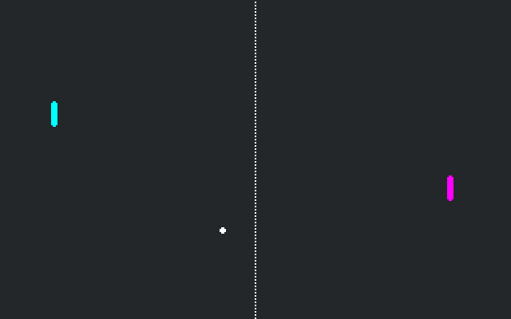

# Pong with VisualScript

A simple Pong game. This demo shows best practices
for game development in Godot, including
[signals](https://docs.godotengine.org/en/latest/getting_started/step_by_step/signals.html).

Language: [VisualScript](https://docs.godotengine.org/en/latest/getting_started/scripting/visual_script/index.html)

Renderer: GLES 2

Note: There is a GDScript version available [here](https://github.com/godotengine/godot-demo-projects/tree/master/2d/pong).

Note: There is a C# version available [here](https://github.com/godotengine/godot-demo-projects/tree/master/mono/pong).

## How does it work?

The walls, paddle, and ball are all
[`Area2D`](https://docs.godotengine.org/en/latest/classes/class_area2d.html)
nodes. When the ball touches the walls or the paddles,
they emit signals and modify the ball.

## Screenshots

